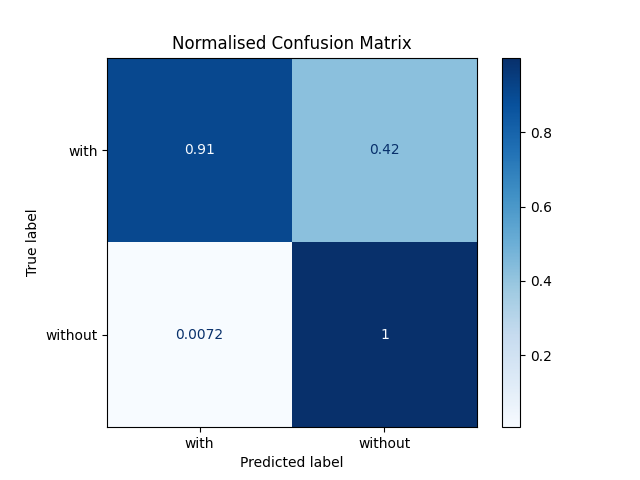

# Face Mask Model Analysis

See source code for model in [model.py](./model.py) and source code for statistical work up in [main.py](./main.py)

# Classifier Metrics

Accuracy = 0.8371428571428572
Precision = 0.9896265560165975
Recall = 0.6814285714285714

F1-Score = 0.8071065989847717

# Confusion Matrix

